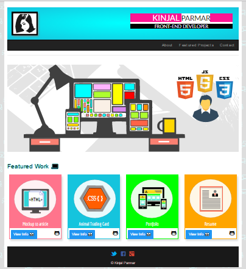

# Build a Portfolio Website

This is the third project under **Udacity Front-End Nanodegree course.** Provided with a design mockup as a PDF-file the task is to replicate that design in HTML and CSS. This website is responsive and display images, descriptions and links to projects which I have completed under the course the Nanodegree program.

#### Screen shot of project:

